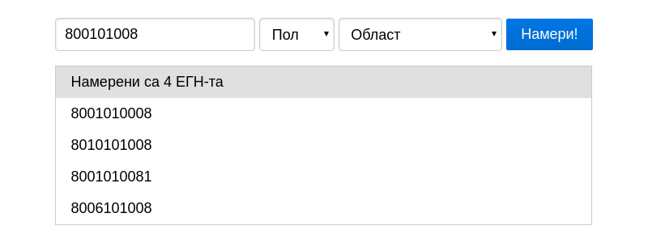
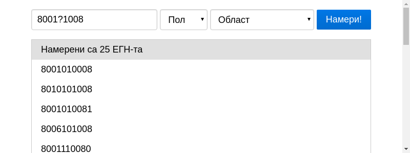
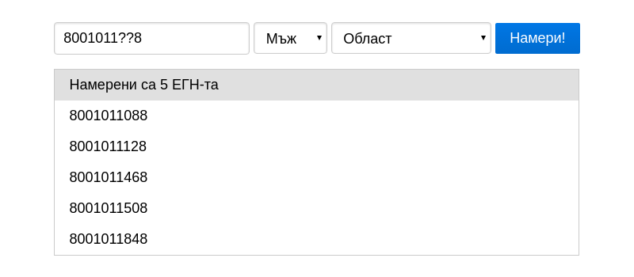
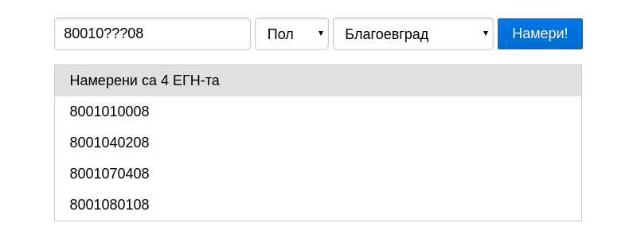

# ЕГН Генератор

Генерира всички валидни ЕГН-та от непълно ЕГН или ЕГН модел.

## Как се използва?

Отворете `index.html` в модерен браузър по Ваш избор, ще видите полета за въвеждане на ЕГН,
пол и област.

В полето за ЕГН може да въведете непълно ЕГН като това **`800101008`** (9 цифри).

Или ЕГН модел като използвате въпросителни знаци за неизвестните цифри (пример **`80?1??1008`**).

Можете дори да въведете непълен ЕГН модел, като този **`8001?1008`** (9 знака).

Полето за пол може да използвате за да ограничите резултатите, до тези ЕГН-та който отговарят на съответния пол.

Полето за област ограничава намерените ЕГН-та, до тези който отговарят на ЕСГРАОН кодовете на областта
(такива ЕГН-та е вероятно да бъдат на хора от тази област).

